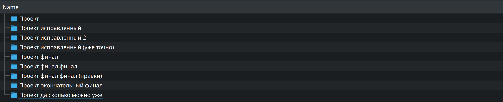
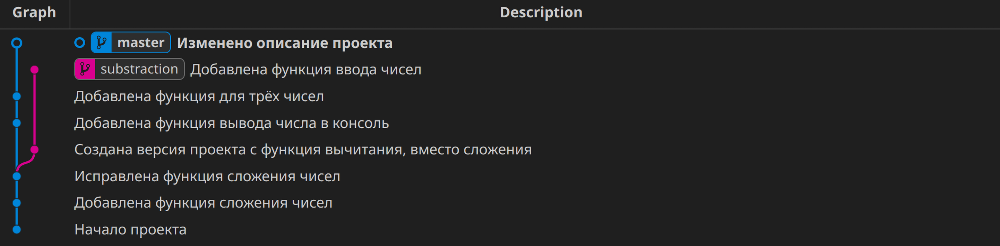
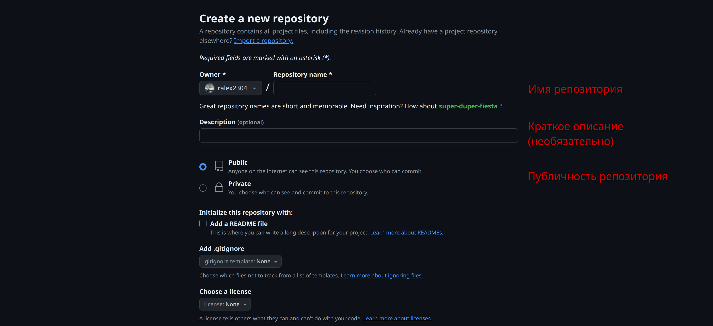
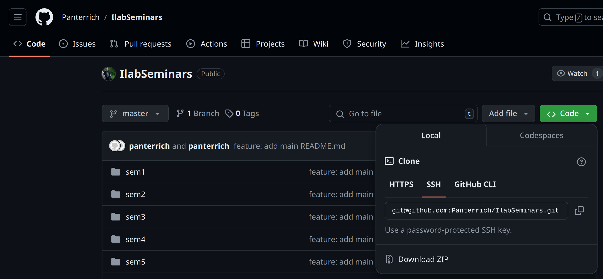
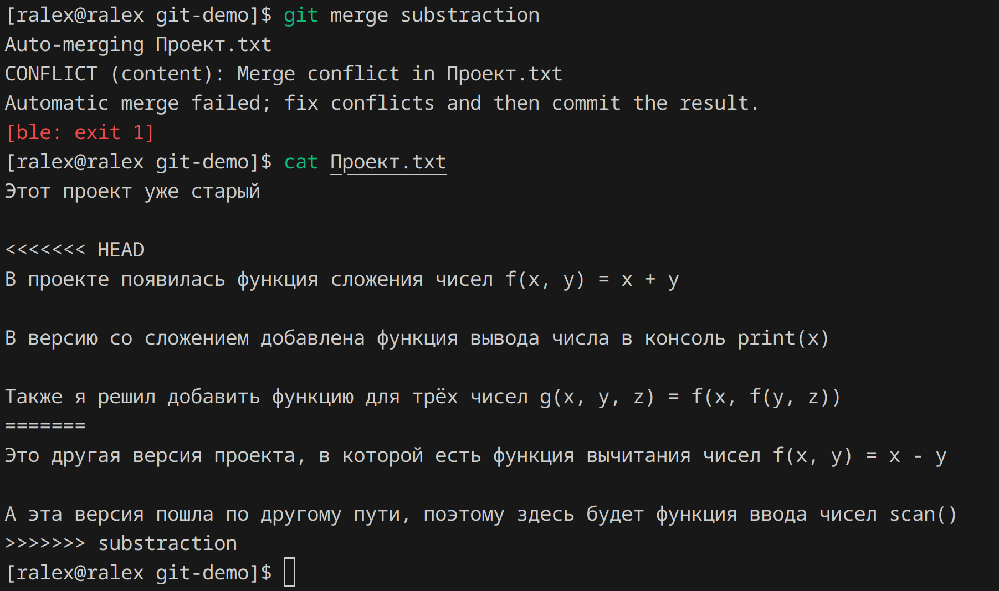

# 2. Git

## Пререквизиты
* [WSL, консоль](../sem1)

## Семинар

Git - это распределённая система контроля версий. Изначально git был разработан Линусом Торвальдсом для написания знакового open source проекта - ядра Linux. Однако сейчас его используют не только для свободного ПО, но и для коммерческой разработки в подавляющем большинстве компаний. Также он полезен и для учебных проектов.

Что же такое система контроля версий и зачем она нужна? В большом проекте часто необходимо иметь возможность откатить изменения, сравнить версии, создать независимые ответвления. Конечно, можно заняться чем-то подобным:

<figure>
    
    <figcaption><i>Хаос. Сотворение мира. И.К. Айвазовский, 1841, холст, масло</i></figcaption>
</figure>

Но зачем, когда есть git?

<figure>
    
    <figcaption><i>Штиль на море. И.К. Айвазовский, 1876, холст, масло</i></figcaption>
</figure>

### Git vs GitHub

Между двумя этими названиями часто возникает путаница. Давайте сразу определимся с понятиями:

- git - система контроля версий, с помощью которой можно создать репозиторий проекта и управлять им

- GitHub - сайт, на который любой желающий может загрузить свои репозитории и поделиться ими со всем миром

Подробнее про GitHub и работу с ним будет рассказано ниже

### Установка git

Для git существует множество графических интерфейсов, но наиболее универсальным и родным для гита способом управления является командная строка.

Ubuntu:
```
sudo apt-get install git
```

После установки нужно задать email и имя пользователя:

```
git config --global user.name "Name"
git config --global user.email "Email"
```

### Создание репозитория

Откроем консоль. Создадим директории нашего проекта и перейдём в неё.

Для создания нового пустого репозитория в данной директории нужно выполнить команду:
```
git init
```

Будет создана скрытая директория `.git`. В ней будет храниться вся необходимая информация, однако просматривать и изменять её не нужно и даже не рекомендуется. Все необходимые действия производятся через разные команды `git`.

### Commit

После создания репозитория можно начать разработку проекта. Например, создать файл с некоторым содержимым. Допустим мы реализовали то, что хотели. Нужно запечатлеть текущее состояние проекта. Для этого существуют коммиты.

Коммит - это некоторая контрольная точка, снимок состояния проекта в конкретный момент времени. Каждый коммит хранит:
- состояние файлов проекта на момент коммита,
- текстовое описание,
- время своего создания,
- автора,
- уникальный хеш (число).

Для создания коммита сначала нужно сообщить гиту, какие именно изменённые или созданные файлы мы хотим учесть в данном коммите. Для этого существует команда:

```
git add file1.txt file2.cpp
```

При помощи команды `git status` можно посмотреть, какие файлы будут учтены в коммите (staged) и какие можно добавить (unstaged).

После можно закоммитить эти изменения:

```
git commit -m "Описание коммита"
```

В описании нужно постараться кратко изложить изменения, которые вносит этот коммит. Например:
- "Добавлена функция solve()"
- "Исправлена ошибка считывания чисел"
- "Реализовано решение уравнений высших степеней"

Эти сообщения в дальнейшем помогут находить нужные версии проекта и сравнивать их между собой, что бывает полезно при отладке и поиске ошибок.

### Загрузка репозитория на github.com

Итак, мы сделали несколько коммитов. Во-первых, хочется защитить проект от, например, случайного удаления - забекапить. Во-вторых, надо же его куда-то выложить, а то никто так и не узнает про него.

Для удалённого хранения репозиториев существует сайт [https://github.com/](https://github.com). Для работы с ним из консоли требуется создать и привязать ssh ключ:

```
ssh-keygen -t ed25519 -C "your_email@example.com"
```

Эта команда спросит о том, куда сохранить файл с ключом. Можно просто нажать `Enter`, тогда он будет сохранён в `~/.ssh/ed25519/`. После можно задать пароль, который будет запрашиваться каждый раз при использовании ключа. Это поле так же можно оставить пустым

После этого надо прикрепить публичную часть ключа к своему аккаунту на GitHub. Выполните команду:

```
cat ~/.ssh/ed25519.pub
```

И скопируйте выведенные символы. Далее зайдите в настройки ключей в GitHub: [https://github.com/settings/keys](https://github.com/settings/keys). Нажмите кнопку `New SSH key`. Вставьте скопированное в поле `Key`. В поле `Title` можно задать заголовок добавленного ключа, например, "Ключ на WSL". После нажмите `Add SSH key`.

Теперь нужно создать новый удалённый репозиторий. Для этого на главной странице нажмите `New`.



Задайте имя репозитория на английском языке, опционально можно добавить описание. Пока лучше оставить репозиторий публичным. Приватные репозитории доступны только вам и добавленным вами контрибьюторам.

Зайдите на страницу созданного репозитория, нажмите `Code`, выберите вкладку `SSH` и скопируйте url, например, `git@github.com:Panterrich/IlabSeminars.git`.



Перейдите в консоль и выполните, заменив url на скопированный:

```
git remote add origin git@github.com:Panterrich/IlabSeminars.git
```

Эта команда свяжет ваш локальный репозиторий и удалённый. Теперь можно залить локальные изменения:

```
git push origin master
```

`origin` - псевдоним адреса удалённого репозитория, а `master` название ветки, которую мы заливаем.

Команду `push` можно делать после каждого изменения (например, коммита).

Также важно отметить, что по умолчанию гит не связывает локальную ветку и удалённую. Удалённые ветки называются `origin/...`. То есть после команды `git push origin master` будут существовать две разные никак не связанные ветки `master` и `origin/master`. Почему это может стать проблемой мы поговорим чуть позже, пока ограничимся тем, что для того чтобы связать эти ветки можно либо выполнить `git branch --set-upstream-to=origin/master master` или передать флаг `-u` команде `git push` (`git push -u origin master`).

### Файл `README.md`

Вы можете добавить файл `README.md` в корневую директорию проекта. Этот файл GitHub будет отображать на странице репозитория. В нём используется язык текстовой разметки `Markdown`.

### Файл `.gitignore`

В этот файл можно добавить правила, по которым git будет игнорировать некоторые файлы из директории репозитория. То есть эти файлы не будут учитываться в коммитах. Примеры правил:

```
example.txt             # игнорировать файлы с именем example.txt
/example.txt            # игнорировать файл с именем example.txt в корневой директории
/example/*              # игнорировать все файлы из директории example
*.txt                   # игнорировать все файлы с расширением .txt

example/*               # игнорировать все файлы в директории example
!example/abc/           # кроме тех, что в директории abc
```

Обычно скрывают объектные, исполняемые и другие бинарные файлы. Пример типичного `.gitignore`:

```
/main
/build/*
```

`Makefile` же наоборот скрывать не стоит.

### Файл `.gitattributes`

Для корректного отображения файлов с кириллицей в кодировке `CP1251` можно использовать файл `.gitattributes`. Правила указания файлов схожи с `.gitignore`:

```
/russian.txt working-tree-encoding=CP1251
```

### Просмотр списка коммитов

Посмотреть историю репозитория можно при помощи

```
git log
```

Каждый коммит имеет уникальный шестнадцатеричный код (хеш). Например, `a846800da8e22ae5a3addd911a44d695c44ee868`. Для удобства его можно сократить до 8 первых символов (`a846800d`). Также существует псевдоним `HEAD`. Он обозначает последний коммит текущей ветки (подробнее про ветки поговорим чуть позже).

Опции:
- `--oneline` - каждый коммит будет представлен кратко одной строкой
- `--all` - показать коммиты по всем веткам, а не только по текущей
- `--graph` - псевдографическое отображение веток (а чтоб было совсем красиво, есть расширение `Git graph` для Vscode)

### Сравнение файлов, версий и показ изменений

С помощью следующей команды можно посмотреть различия, между текущими файлами и их состоянием в каком-либо коммите.

```
git diff <commit>
```

Например

```
git diff a846800d
```

Листать вывод этой команды нужно при помощи стрелок, выход - `q`.

Также можно сравнивать коммиты между собой, нужно просто указать хеш второго коммита через пробел.

Посмотреть сравнение только по одному файлу можно добавив в конец команды `-- <filename>`.

Также можно сравнить два разных файла, расположенных на компьютере.

```
git diff --no-index -- <file1> <file2>
```

### Что делать, если что-то пошло не так?

Можно в одну команду создать новый коммит, который отменит изменения, внесённый указанным коммитом:

```
git revert <commit>
```

> [!WARNING]
> Если вы уже сделали `git push`, то не следует пользоваться следующими методами. После публикации изменений вносить правки нужно только новыми коммитами!!!

Часто бывает, что мы сделали коммит и почти сразу вспомнили, что забыли в него добавить какой-то файл или ошиблись в имени коммита. Для таких незначительных изменений существует опция `--amend` для `git commit`.

Например:
```
git commit --amend -m "Новое имя коммита без ошибки"
```

Действия до этой команды такие же, как и при обычном коммите. Только на этот раз все изменения применятся к последнему коммиту, создание нового не произойдёт.

Можно удалить коммит (это не то же самое, что делает `git revert`). Для этого существует команда `git reset`. У неё есть два режима:

- `--soft` - удалить коммит из истории, но оставить все файлы неизменными
- `--hard` - удалить коммит вместе с изменениями (из файлов удалятся изменения, внесённые этим коммитом)

Например:

```
git reset --soft a846800d
```

### Как отложить текущие изменения?

Иногда возникают ситуации, когда требуется срочно закоммитить небольшое изменение, а мы работаем над какой-то крупной фичей и у нас есть куча незакомиченных изменений. Можно использовать команду

```
git stash
```

После её выполнения все файлы вернутся к состоянию последнего коммита. И можно будет делать, что нужно, например, сделать тот самый небольшой коммит. В конце можно выполнить следующую команду, и все отложенные изменения вернутся:

```
git stash pop
```

### Ветки

Что такое ветка? Это последовательность коммитов. При создании репозитория автоматически создаётся ветка с именем `master`.

При разработке очень часто возникает необходимость в ветках. Обычно существует главная ветка, в которой расположена стабильная версия проекта. От неё отходят ветки для разработки фичей или багфиксов. После завершения работы над изменениями эти ветки сливают (мерджат) с главной


На диаграмме изображены 3 ветки (они обозначены разными цветами). Прямоугольные блоки - это коммиты.

- Сначала был создан коммит `Version 1`.
- От него начаты 2 ветки:
    - В жёлтой ветке создали два коммита и слили её с синей - появился мердж-коммит `Version 2`.
    - Теперь нужно залить зелёную ветку, в ней уже есть 1 коммит. Здесь возникла ситуация, когда нужен `rebase` - перемещение начала ветки на другой коммит. Это нужно, чтобы изменения, которые были внесены коммитом `Version 2` применились к зелёной ветке.
    - После ребейза можно слить и зелёную ветку.

#### Работа с ветками

> [!NOTE]
> На самом деле, имя ветки в гит - это просто указатель на последний коммит ветки. При каждом коммите, этот указатель сдвигается

Новую ветку можно создать при помощи команды

```
git branch <name>
```

Переключение между ветками делается так:

```
git checkout <name>
```

Обратите внимание на то, что переключиться получится только если все локальные изменения закоммичены или их нет (тут кстати может помочь `git stash`).

Можно удобно создать и переключиться на ветку одной командой:

```
git checkout -b <name>
```

#### Слияние веток

Для слияния нужно переключиться на ветку, в которую мы хотим влить другую (`git checkout`).

Далее выполняем (вместо `<branch>` нужно указать имя вливаемой ветки):

```
git merge <branch> -m "Имя коммита"
```

##### Конфликт при слиянии

Иногда при мердже могут возникнуть конфликты. Такое происходит, когда какие то строки в файле менялись в обеих ветках, и гит не может понять, какую версию применить. Команда `git merge` сообщит об этом. Эти конфликты можно разрешить или вручную в каждом исходнике или через интерактивный интерфейс в vscode.

К примеру. Я выполнил `git merge substraction`, находясь в ветке `master`:



Git отредактировал файл с конфликтом, и показал в нём отличия. Нам нужно оставить в файле тот вариант, который мы считаем правильным (можно либо выбрать что-то из предложенного, либо вообще написать что-то своё)

Далее нужно выполнить `git merge --continue`. Если хочется отменить мердж, то можно выполнить `git merge --abort`.

#### Rebase ветки

Нужно переключиться на ветку, для которой делаем `rebase`. Далее указываем ветку, или коммит, на который хотим переместить текущую ветку.

```
git rebase <branch>
```

При `rebase` также могут произойти конфликты. Разрешаются они точно так же, как с `merge`. Для продолжения и отмены нужно выполнить `git rebase --continue` и `git rebase --abort` соответственно.

### Подтягивание изменений из удалённого репозитория

Допустим мы работаем с нескольких компьютеров или с коллегой. Тогда в удалённом репозитории будут возникать изменения, которых в нашей локальной версии нет.

Есть команда `git fetch`. Она скачает все изменения или напишет, что их нет. Однако она не меняет ничего в локальной версии репозитория.

Для того, чтобы применить изменения есть команда `git pull`. Она применит изменения для текущей ветки. Отметим, что `git pull` автоматически выполняет `git fetch`.

Мы упоминали про связывание локальной и удалённой веток между собой когда говорили про `git push`. Так вот при `git pull` это оказывается важным. Если ветки не связаны, то гит не будет знать из какой удалённо ветки применять изменения в локальную.

При `git pull` так же могут возникнуть некоторые конфликты. Здесь несколько вариантов:
- `git pull --rebase` произведёт `rebase` локальной ветки.
- `git pull --commit` смерджит локальную и удалённую ветки.

### Как посмотреть, кто виноват в конкретной строчке кода

Для обнаружения авторства есть команда `git blame`. Ей можно указать конкретный файл, и она укажет автора каждой строки и каким коммитом она последний раз менялась.

## Итог

- Что такое **git**?
    - Система контроля версий
- Что такое **репозиторий**?
    - Файлы вашего проекта и история их изменений
- Что такое **GitHub**?
    - Сайт для удалённого хранения ваших репозиториев
- Что такое **коммит**?
    - Снимок состояния проекта, снабжённый описанием
- Что такое **ветка**?
    - Последовательность коммитов
- Что такое
- Зачем это всё нужно?
    - В учёбе:
        - бекап проекта;
        - выявления изменений для исправления случайных ошибок;
        - возможность откатить изменения или создать несколько параллельных версий проекта.
    - В работе:
        - хранение истории проекта;
        - удобство совместной разработки;
        - возможность проверки кода перед принятием в основную ветку;
        - отслеживание и исправление ошибок.
    - В open source:
        - открытость кода, прозрачность, история проекта;
        - возможность создания своих ответвлений, а также внесения улучшений в проект;
        - удобство децентрализованной разработки (часто на добровольной основе).
